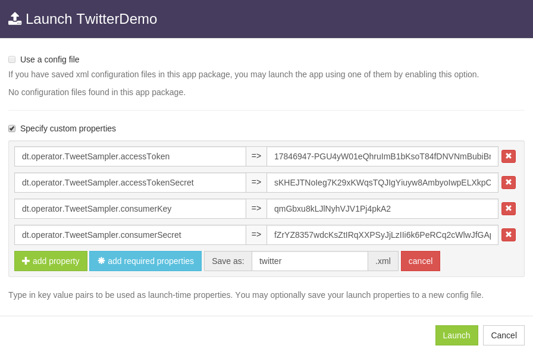

Running Demo Applications
=================================

DataTorrent RTS includes a number of demo applications, which help demonstrate the features of the platform.  These demos are available for import from the **Development > App Packages** section of the DataTorrent management console.

Importing Demo Applications
--------------------------------------------------------------------------------

1.  Navigate to **Develop > App Packages > Import** section of the DataTorrent console.
2.  Select one of the available packages, such as *Apache Apex Malhar Pi Demo* and click *Import* button.
3.  Imported packages and included applications will be listed under **Develop > App Packages** page.

Launching Demo Applications
--------------------------------------------------------------------------------

After the right application packages have been imported, many demo applications can be launched with a single click.  *Note*: Ensure Hadoop YARN and HDFS services are active and ready by making sure there are no errors in the DataTorrent console before launching demo applications.

1.  Navigate to **App Packages** under **Develop** tab of the DataTorrent console, and select one of the imported demo packages.  In this example we will use **PiDemo** application package.

2.  From the list of available Applications, locate PiDemo and press the launch button.

    

3.  Proceed with default options on launch confirmation screen by pressing the Launch button.

4.  Once launched, view the running application by following the link provided in the launch confirmation dialog, or by navigating to the **Monitor** section of the console and selecting the launched application.

    

More information about using DataTorrent console is available in [dtManage Guide](dtmanage.md)

Configuring Launch Parameters
--------------------------------------------------------------------------------

Some applications may require additional configuration changes prior to launching.  Configuration changes can be made on the launch confirmation screen or manually applied to `~/.dt/dt-site.xml` configuration file.  These typically include adding Twitter API keys for twitter demo, or changing performance settings for larger applications.  Guides for various demo applications can be found in the [Creating Applications](create.md) guide.

1.  Navigate to **App Packages** under **Develop** tab of the DataTorrent console.  In this example we will use **Apache Apex Malhar Twitter Demo** application package.  Import this package from *Develop > App Packages > Import* if it is not available.

2.  From the list of Applications, select TwitterDemo and press the corresponding launch button.

3.  Retrieve Twitter API access information by registering for <a href="https://dev.twitter.com/" target="\_blank">Twitter Developer</a> account, creating a new <a href="https://apps.twitter.com/app/new" target="\_blank">Twitter Application</a>, and navigating to Keys and Access Tokens tab.  Twitter Demo application requires the following to be specified by the user:

    dt.operator.TweetSampler.accessToken
    dt.operator.TweetSampler.accessTokenSecret
    dt.operator.TweetSampler.consumerKey
    dt.operator.TweetSampler.consumerSecret

4.  Select *Specify custom properties* on the launch confirmation screen, click *add required properties* button, and provide Twitter API access values.  Choose to save this configuration as `twitter.xml` file and proceed to Launch the application.

    

5.  Once launched, view the running application by following the link provided in the launch confirmation dialog, or by navigating to the **Monitor** section of the console and selecting the launched application.

6.  View the top 10 tweeted hashtags in real time by generating and viewing the [dashboard](dtdashboard.md).

Stopping Applications
--------------------------------------------------------------------------------

Applications can be shut down or killed from the Monitor section of [dtManage](dtmanage.md) by selecting application from the list and clicking `shutdown` or `kill` buttons.
